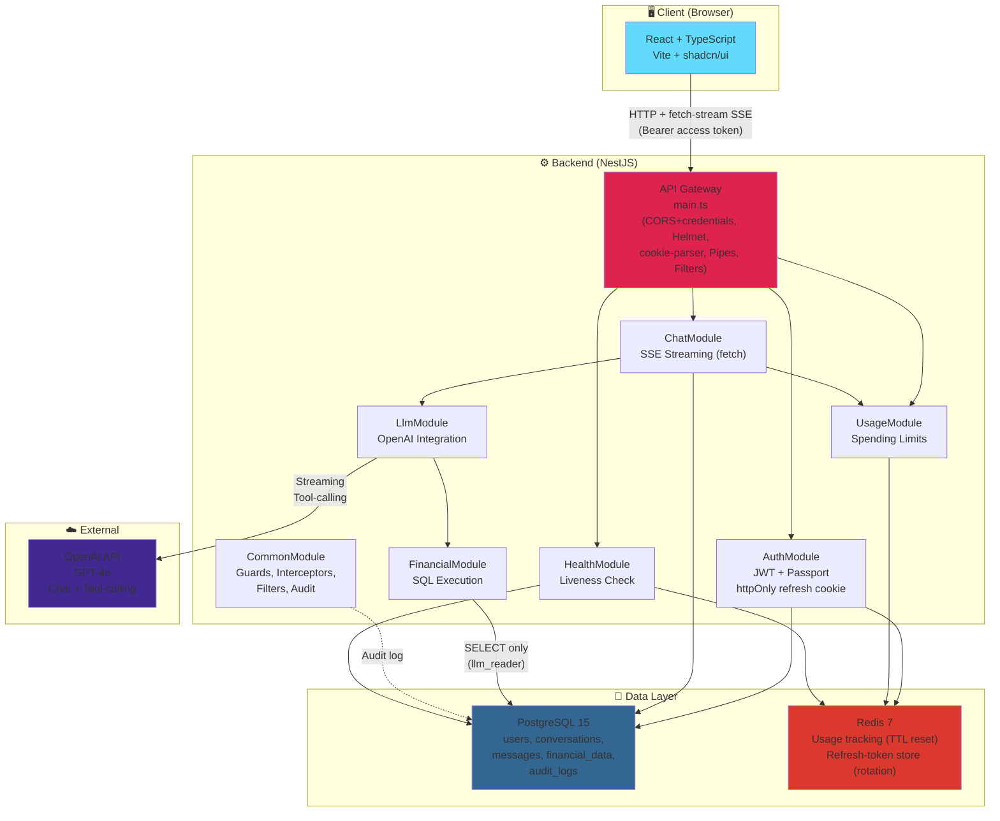
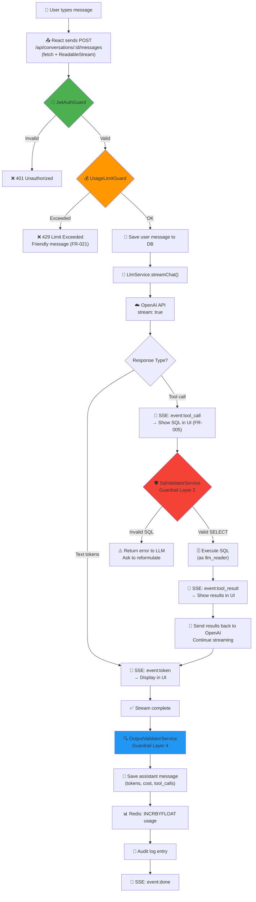
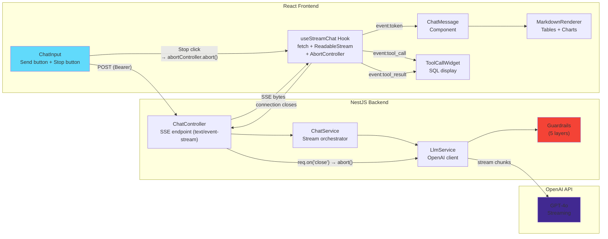
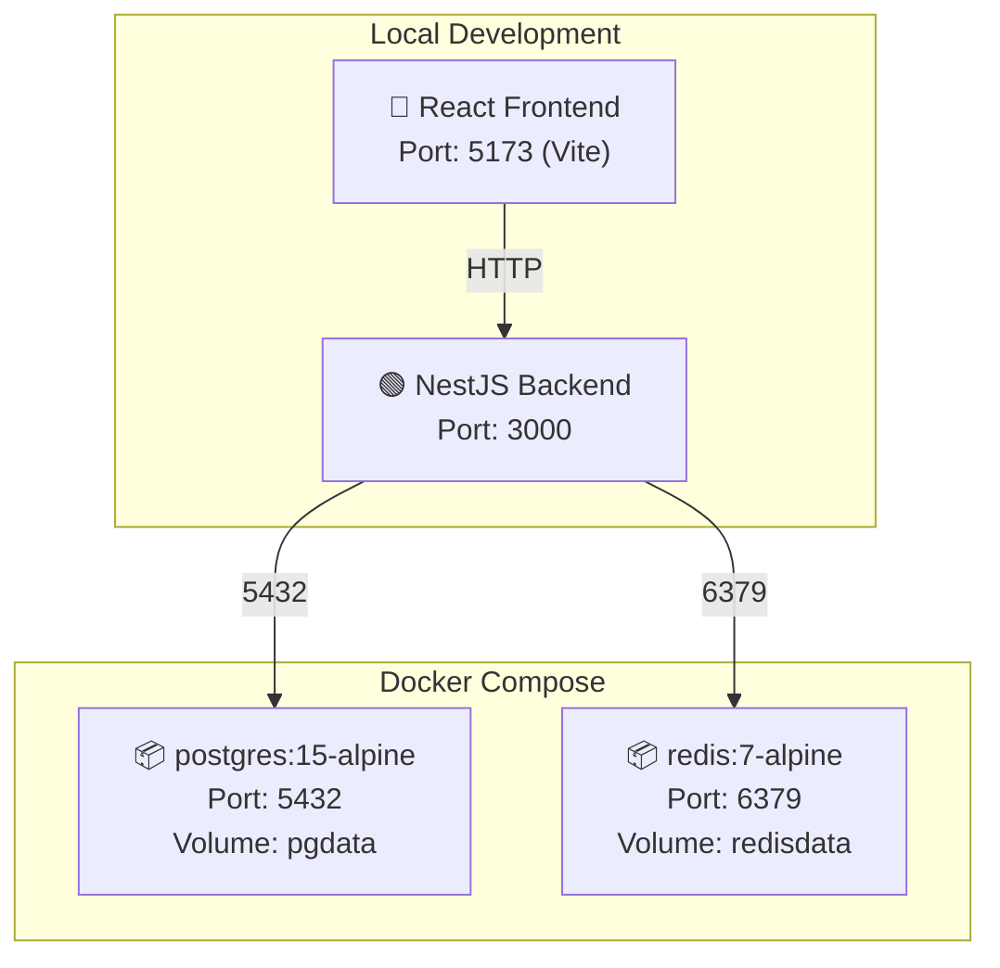

# 🏗️ Architecture Overview — Financial Data Chat Assistant

> Date: 2026-07-06
> Type: AI-powered financial data chat application
> Stack: React + NestJS + PostgreSQL + Redis + OpenAI GPT-4o

---

## 1. High-Level Architecture



---

## 2. Data Flow — Chat Message Lifecycle



---

## 3. Authentication Flow

> **Token model (CR-016):** the **access token** is short-lived (~15 min) and returned in the
> JSON body — the client keeps it **in memory only**. The **refresh token** is long-lived and
> delivered as an **httpOnly, Secure, SameSite=Strict cookie** scoped to `/api/auth/refresh`.
> The browser stores and transmits it automatically; JavaScript can never read it. Every
> refresh **rotates** the token (single-use) and its hash is tracked in Redis for revocation
> and reuse detection.

```mermaid
sequenceDiagram
    participant U as User
    participant F as React Frontend
    participant B as NestJS Backend
    participant DB as PostgreSQL
    participant R as Redis

    Note over U,R: Registration (FR-012)
    U->>F: Fill registration form
    F->>B: POST /api/auth/register
    B->>B: Validate DTO (class-validator)
    B->>B: Hash password (bcrypt, cost 12)
    B->>DB: INSERT INTO users
    B->>B: Generate access JWT + refresh token (jti)
    B->>R: SET refresh:{userId}:{jti} = sha256(refresh) EX ttl
    B-->>F: 201 { accessToken, expiresIn, user }<br/>Set-Cookie: refreshToken=... HttpOnly; Secure; SameSite=Strict
    F->>F: Keep accessToken in memory (Zustand); cookie handled by browser

    Note over U,R: Login (FR-013)
    U->>F: Enter email + password
    F->>B: POST /api/auth/login
    B->>DB: SELECT user WHERE email = ?
    B->>B: bcrypt.compare(password, hash)
    B->>B: Generate access JWT + refresh token (jti)
    B->>R: SET refresh:{userId}:{jti} = sha256(refresh) EX ttl
    B-->>F: 200 { accessToken, expiresIn, user }<br/>Set-Cookie: refreshToken=... (httpOnly)

    Note over U,R: Authenticated Request
    F->>B: GET /api/conversations (Authorization: Bearer <access>)
    B->>B: JwtStrategy.validate(access token)
    B->>DB: SELECT conversations WHERE user_id = ?
    Note over B: FR-014: User isolation via user_id scope
    B-->>F: [conversations]

    Note over U,R: Token Refresh (rotation) — on app mount or 401
    F->>B: POST /api/auth/refresh<br/>(no body; browser sends httpOnly cookie)
    B->>R: GET refresh:{userId}:{jti} — verify hash matches
    alt Valid & not yet used
        B->>R: DEL old jti; SET new refresh:{userId}:{newJti}
        B-->>F: 200 { accessToken, expiresIn }<br/>Set-Cookie: refreshToken=<rotated> (httpOnly)
    else Missing/mismatch (reuse or expiry)
        B->>R: SCAN refresh:{userId}:* + DEL (revoke session family)
        B-->>F: 401 → client must log in again
    end

    Note over U,R: Logout
    F->>B: POST /api/auth/logout (Bearer + cookie)
    B->>R: DEL refresh:{userId}:{jti}
    B-->>F: 200; Set-Cookie: refreshToken=; Max-Age=0 (clear cookie)
```

---

## 4. Streaming Architecture

> **Transport (FR-004):** streaming uses **`fetch()` + `ReadableStream`**, not the native
> `EventSource`. This is required because the stream is delivered on a **POST** (which
> `EventSource` cannot issue) and because the request must carry an `Authorization: Bearer`
> header (which `EventSource` cannot set). The wire format is still SSE
> (`event:` / `data:` lines). The **Stop** button and browser refresh both abort the request
> via an `AbortController`, which the server observes through `req.on('close')`.



---

## 5. Component Interaction Summary

| Layer | Component | Communicates With | Protocol |
|-------|-----------|-------------------|----------|
| Frontend | React App | NestJS API | HTTP REST + fetch-stream SSE |
| Backend | AuthModule | PostgreSQL, Redis | TypeORM (SQL), ioredis (refresh tokens) |
| Backend | ChatModule | PostgreSQL, LlmModule, UsageModule | TypeORM, Internal DI |
| Backend | LlmModule | OpenAI API, FinancialModule | HTTPS (streaming), TypeORM |
| Backend | FinancialModule | PostgreSQL | TypeORM (read-only) |
| Backend | UsageModule | Redis | ioredis (atomic ops) |
| Backend | HealthModule | PostgreSQL, Redis | TypeORM, ioredis |
| Backend | CommonModule | PostgreSQL | TypeORM (audit_logs) |

---

## 6. Key Architectural Decisions

| Decision | Rationale | Requirement |
|----------|-----------|-------------|
| SSE over fetch (not WebSocket, not EventSource) | One-directional streaming; POST + Bearer header required, which `EventSource` cannot do | FR-004, NFR-001 |
| Hybrid token storage (access in memory + refresh in httpOnly cookie) | XSS containment: refresh token unreadable by JS; access token short-lived; Bearer scheme preserved for API clients | CR-016, GAP-002 |
| Refresh-token rotation with Redis | Single-use tokens + server-side hash enable revocation and reuse detection | CR-016 |
| Redis for usage tracking | Atomic INCRBYFLOAT + TTL auto-reset, no cron needed | FR-009, FR-010 |
| Separate DB user for LLM queries | Defense-in-depth: even if guardrail layer 2 fails, the DB rejects writes | GAP-001, CR-001 |
| UUID primary keys | Better for distributed systems, no sequence prediction attacks | Security |
| Soft-delete for conversations | PDPA compliance (right to erasure) + undo capability | CR-007, FR-019 |
| Feature-based modules | Each module is self-contained, easy to extend in the live session | NFR-003, NFR-009 |
| TypeORM over Prisma | Better raw-query support for LLM-generated SQL execution | GAP-001, FR-007 |
| GPT-4o over gpt-4o-mini | Higher SQL generation accuracy, critical for no-hallucination | FR-007, CR-003 |

---

## 7. Docker Compose Topology



```yaml
# docker-compose.yml
version: '3.8'
services:
  postgres:
    image: postgres:15-alpine
    ports: ['5432:5432']
    environment:
      POSTGRES_DB: financial_db
      POSTGRES_USER: postgres
      POSTGRES_PASSWORD: postgres
    volumes:
      - pgdata:/var/lib/postgresql/data
      - ./data/financial_data.sql:/docker-entrypoint-initdb.d/01-data.sql

  redis:
    image: redis:7-alpine
    ports: ['6379:6379']
    volumes:
      - redisdata:/data

volumes:
  pgdata:
  redisdata:
```

> **Note (GAP-009):** the `Secure` attribute on the refresh cookie requires HTTPS. For local
> development over `http://localhost` browsers treat `localhost` as a secure context, so the
> cookie still works; in any deployed environment the app must sit behind TLS (reverse proxy).
