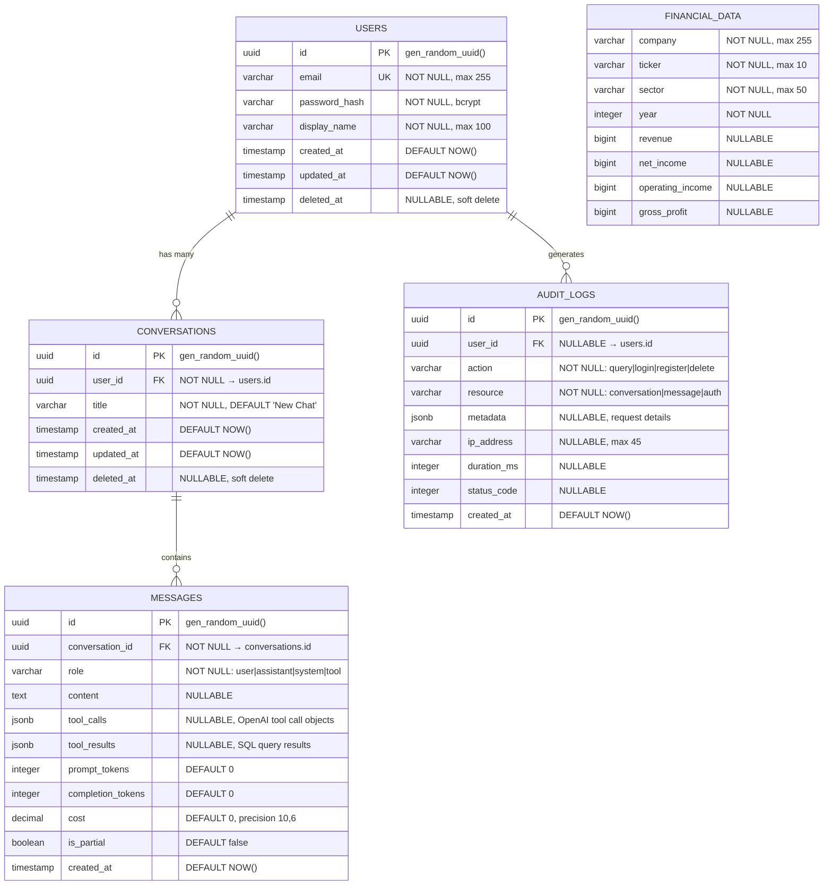

# 🗂️ Data Model & ERD — Financial Data Chat Assistant

> Date: 2026-07-06
> Database: PostgreSQL 15+
> ORM: TypeORM 0.3+

---

## Entity-Relationship Diagram



---

## Table Definitions

### 1. `users` — FR-012, FR-013, FR-014, CR-005, CR-007

| Column | Type | Constraints | TypeORM Decorator |
|--------|------|-------------|-------------------|
| id | UUID | PK, DEFAULT gen_random_uuid() | `@PrimaryGeneratedColumn('uuid')` |
| email | VARCHAR(255) | UNIQUE, NOT NULL | `@Column({ unique: true })` |
| password_hash | VARCHAR(255) | NOT NULL | `@Column({ select: false })` |
| display_name | VARCHAR(100) | NOT NULL | `@Column()` |
| created_at | TIMESTAMP | DEFAULT NOW() | `@CreateDateColumn()` |
| updated_at | TIMESTAMP | DEFAULT NOW() | `@UpdateDateColumn()` |
| deleted_at | TIMESTAMP | NULLABLE | `@DeleteDateColumn()` |

**Indexes:**
- `idx_users_email` — UNIQUE on `email` (login lookup)

**Relations:**
- `users` → `conversations` (1:N)
- `users` → `audit_logs` (1:N)

**Notes:**
- `password_hash` uses `select: false` so it is never loaded by default (GAP-003)
- `deleted_at` supports soft-delete per PDPA CR-007 (right to erasure)

---

### 2. `conversations` — FR-001, FR-014, FR-018, FR-019, FR-020

| Column | Type | Constraints | TypeORM Decorator |
|--------|------|-------------|-------------------|
| id | UUID | PK | `@PrimaryGeneratedColumn('uuid')` |
| user_id | UUID | FK → users.id, NOT NULL | `@Column()` + `@ManyToOne()` |
| title | VARCHAR(255) | NOT NULL, DEFAULT 'New Chat' | `@Column({ default: 'New Chat' })` |
| created_at | TIMESTAMP | DEFAULT NOW() | `@CreateDateColumn()` |
| updated_at | TIMESTAMP | DEFAULT NOW() | `@UpdateDateColumn()` |
| deleted_at | TIMESTAMP | NULLABLE | `@DeleteDateColumn()` |

**Indexes:**
- `idx_conversations_user_id` — on `user_id` (list conversations by user)
- `idx_conversations_updated_at` — on `updated_at` DESC (sort by recent)

**Relations:**
- `conversations` → `users` (N:1, ON DELETE CASCADE)
- `conversations` → `messages` (1:N, CASCADE)

**Notes:**
- `user_id` + scoped queries ensure users see only their own conversations (FR-014)
- Soft-delete supports FR-019 (delete conversation with confirmation)

---

### 3. `messages` — FR-004, FR-005, FR-016, FR-017, NFR-007, NFR-008

| Column | Type | Constraints | TypeORM Decorator |
|--------|------|-------------|-------------------|
| id | UUID | PK | `@PrimaryGeneratedColumn('uuid')` |
| conversation_id | UUID | FK → conversations.id, NOT NULL | `@Column()` + `@ManyToOne()` |
| role | VARCHAR(20) | NOT NULL | `@Column()` |
| content | TEXT | NULLABLE | `@Column({ type: 'text', nullable: true })` |
| tool_calls | JSONB | NULLABLE | `@Column({ type: 'jsonb', nullable: true })` |
| tool_results | JSONB | NULLABLE | `@Column({ type: 'jsonb', nullable: true })` |
| prompt_tokens | INTEGER | DEFAULT 0 | `@Column({ default: 0 })` |
| completion_tokens | INTEGER | DEFAULT 0 | `@Column({ default: 0 })` |
| cost | DECIMAL(10,6) | DEFAULT 0 | `@Column({ type: 'decimal', precision: 10, scale: 6, default: 0 })` |
| is_partial | BOOLEAN | DEFAULT false | `@Column({ default: false })` |
| created_at | TIMESTAMP | DEFAULT NOW() | `@CreateDateColumn()` |

**Indexes:**
- `idx_messages_conversation_id` — on `conversation_id` (load messages by conversation)
- `idx_messages_created_at` — on `created_at` ASC (ensures correct order — NFR-008)

**`role` enum values:**
- `user` — message from the user
- `assistant` — response from the LLM
- `tool` — result from a SQL tool call

**Notes:**
- `tool_calls` stores OpenAI tool call objects for UI rendering (FR-005)
- `tool_results` stores SQL query results as a JSON array
- `is_partial = true` when the user stops mid-generation (FR-016)
- `cost` is computed from token usage for usage tracking (FR-017)
- `content` is nullable because tool-role messages may have no text content

---

### 4. `financial_data` — FR-022 (Provided, read-only)

| Column | Type | Constraints | Notes |
|--------|------|-------------|-------|
| company | VARCHAR(255) | NOT NULL | e.g., "Apple", "JPMorgan" |
| ticker | VARCHAR(10) | NOT NULL | e.g., "AAPL", "JPM" |
| sector | VARCHAR(50) | NOT NULL | Technology, Finance, Healthcare, Consumer, Energy |
| year | INTEGER | NOT NULL | 2022-2025 |
| revenue | BIGINT | NULLABLE | USD |
| net_income | BIGINT | NULLABLE | USD |
| operating_income | BIGINT | NULLABLE | USD |
| gross_profit | BIGINT | NULLABLE | USD |

**Indexes:**
- `idx_financial_company_year` — on `(company, year)` (common query pattern)
- `idx_financial_sector` — on `sector` (sector-based queries)
- `idx_financial_ticker` — on `ticker` (ticker-based queries)

**Notes:**
- Loaded from `data/financial_data.sql` (pg_dump COPY format)
- 48 companies × 4 years = 192 rows
- **Read-only** — LLM queries run as a separate `llm_reader` DB user (Guardrail Layer 3)
- Some columns are NULL for some companies (e.g., Goldman and Wells Fargo have no revenue)

---

### 5. `audit_logs` — CR-002, CR-018, GAP-008

| Column | Type | Constraints | TypeORM Decorator |
|--------|------|-------------|-------------------|
| id | UUID | PK | `@PrimaryGeneratedColumn('uuid')` |
| user_id | UUID | FK → users.id, NULLABLE | `@Column({ nullable: true })` |
| action | VARCHAR(50) | NOT NULL | `@Column()` |
| resource | VARCHAR(50) | NOT NULL | `@Column()` |
| metadata | JSONB | NULLABLE | `@Column({ type: 'jsonb', nullable: true })` |
| ip_address | VARCHAR(45) | NULLABLE | `@Column({ nullable: true })` |
| duration_ms | INTEGER | NULLABLE | `@Column({ nullable: true })` |
| status_code | INTEGER | NULLABLE | `@Column({ nullable: true })` |
| created_at | TIMESTAMP | DEFAULT NOW() | `@CreateDateColumn()` |

**Indexes:**
- `idx_audit_user_id` — on `user_id` (query by user)
- `idx_audit_action` — on `action` (query by action type)
- `idx_audit_created_at` — on `created_at` DESC (recent first)

**`action` values:**
- `query` — LLM-generated SQL query executed
- `login` / `register` / `logout` — auth events
- `delete_conversation` — conversation deletion
- `error` — error events

**Notes:**
- **Append-only** — UPDATE and DELETE are forbidden (SOX §802 immutable audit trail)
- `metadata` stores JSON: `{ sql: "...", results_count: N, model: "gpt-4o" }`
- Nullable `user_id` for system-level logs (health checks, etc.)

---

## Redis Data (not stored in PostgreSQL)

### Usage Tracking — FR-009, FR-010, FR-011

Usage tracking uses **Redis** instead of a database table because:
- Atomic increments are required (`INCRBYFLOAT`)
- Auto-reset via TTL expiry (FR-010)
- High-frequency reads/writes per request

**Redis Key Structure:**

```
usage:{userId}  →  float (cumulative spend in USD)
  TTL: {resetInterval} seconds (default 3600)
```

**Operations:**
```
INCRBYFLOAT usage:{userId} {cost}    # Track spend
GET usage:{userId}                    # Check current spend
TTL usage:{userId}                    # Time until reset
EXPIRE usage:{userId} {interval}     # Set reset window (first use)
```

### Refresh-Token Store — CR-016 (token rotation & revocation)

Refresh tokens are stored server-side in Redis (SHA-256 hash, never the raw token) so that
rotation, revocation, and reuse detection are possible. The raw token lives only in the
client's httpOnly cookie.

**Redis Key Structure:**

```
refresh:{userId}:{jti}  →  sha256(refreshToken)
  TTL: {refreshTokenTtl} seconds (default 7 days)
```

**Operations & rules:**
```
SET refresh:{userId}:{jti} {hash} EX {ttl}   # On login/refresh (rotation issues a new jti)
GET refresh:{userId}:{jti}                    # On /auth/refresh: must exist AND hash must match
DEL refresh:{userId}:{jti}                    # On rotation (old token invalidated) and on logout
SCAN refresh:{userId}:* + DEL                 # Reuse detected → revoke the entire session family
```

- **Rotation** — every successful `/auth/refresh` deletes the old key and writes a new one; a refresh token is single-use
- **Reuse detection** — a presented token whose key no longer exists implies theft; all of that user's refresh keys are revoked and re-authentication is required
- **Logout** — deletes the presented token's key and instructs the browser to clear the cookie

---

## Migration Strategy

```bash
# TypeORM migrations (never use synchronize: true in production)
npm run migration:generate -- -n InitialSchema
npm run migration:run

# Financial data loading (separate step)
psql -U postgres -d financial_db -f data/financial_data.sql
```
