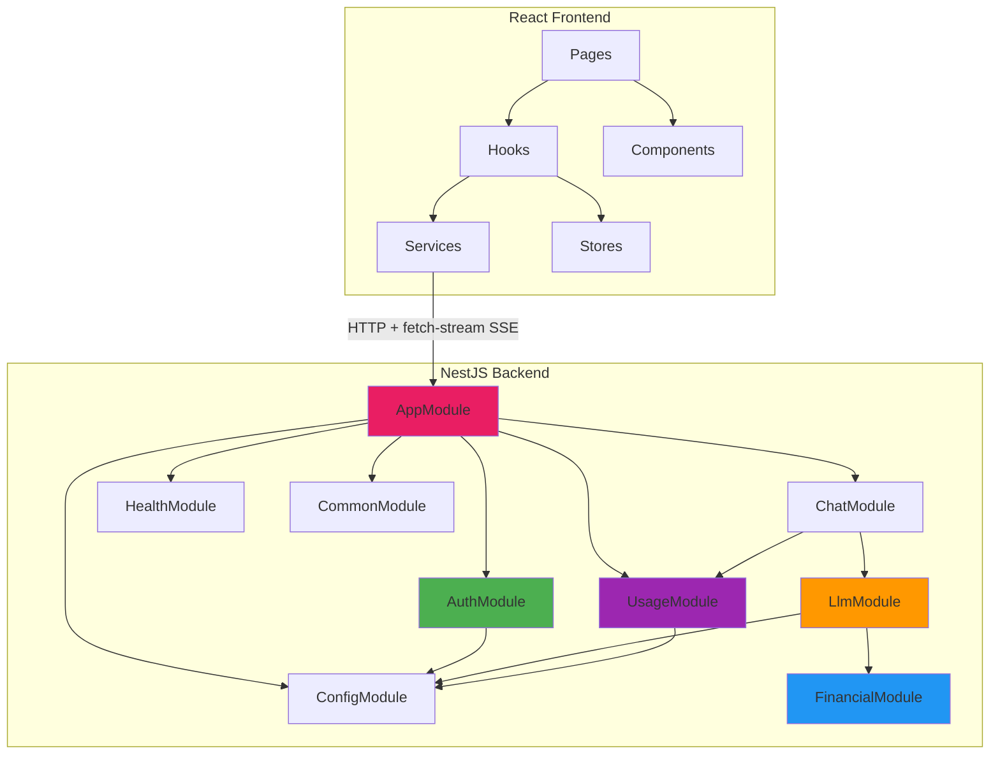

# 📁 Folder Structure — Financial Data Chat Assistant

> Date: 2026-07-06
> Backend: NestJS 10+ (TypeScript)
> Frontend: React 18+ (TypeScript)
> Pattern: Feature-based module organization

---

## Project Root

```
siametrics-chat/
├── docker-compose.yml                    # PostgreSQL + Redis
├── .env.example                          # Environment variables template
├── .gitignore
├── README.md                             # Setup & run instructions (NFR-006)
│
├── backend/                              # NestJS application
│   ├── package.json
│   ├── tsconfig.json
│   ├── tsconfig.build.json
│   ├── nest-cli.json
│   ├── .env                              # Local env (gitignored)
│   ├── src/
│   │   ├── main.ts                       # Bootstrap: CORS (credentials: true), Helmet,
│   │   │                                 # cookie-parser, Pipes, Filters
│   │   ├── app.module.ts                 # Root module: imports all feature modules
│   │   │
│   │   ├── config/                       # ── ConfigModule ──
│   │   │   ├── config.module.ts          # @nestjs/config setup
│   │   │   ├── app.config.ts             # Typed app configuration
│   │   │   └── database.config.ts        # TypeORM connection config
│   │   │
│   │   ├── auth/                         # ── AuthModule ──
│   │   │   ├── auth.module.ts            # FR-012, FR-013, GAP-002
│   │   │   ├── auth.controller.ts        # /api/auth/* endpoints
│   │   │   │                             # Sets/clears the httpOnly refresh cookie (CR-016)
│   │   │   ├── auth.service.ts           # Register, login, token rotation logic
│   │   │   ├── services/
│   │   │   │   └── refresh-token.service.ts  # Redis-backed refresh-token store:
│   │   │   │                             # rotation, revocation, reuse detection
│   │   │   ├── strategies/
│   │   │   │   ├── jwt.strategy.ts       # JWT validation strategy (access token)
│   │   │   │   └── local.strategy.ts     # Email/password strategy
│   │   │   ├── guards/
│   │   │   │   └── jwt-auth.guard.ts     # JWT Bearer guard
│   │   │   ├── dto/
│   │   │   │   ├── register.dto.ts       # RegisterRequest validation
│   │   │   │   └── login.dto.ts          # LoginRequest validation
│   │   │   │                             # (No refresh.dto.ts — refresh token arrives
│   │   │   │                             #  via httpOnly cookie, not the request body)
│   │   │   ├── entities/
│   │   │   │   └── user.entity.ts        # User TypeORM entity
│   │   │   └── auth.service.spec.ts      # Unit tests
│   │   │
│   │   ├── chat/                         # ── ChatModule ──
│   │   │   ├── chat.module.ts            # FR-001, FR-014, FR-018, FR-019
│   │   │   ├── chat.controller.ts        # /api/conversations/* endpoints
│   │   │   ├── chat.service.ts           # Conversation CRUD, message streaming
│   │   │   ├── dto/
│   │   │   │   ├── create-message.dto.ts # Message input validation
│   │   │   │   └── conversation.dto.ts   # Conversation response DTO
│   │   │   ├── entities/
│   │   │   │   ├── conversation.entity.ts # Conversation TypeORM entity
│   │   │   │   └── message.entity.ts     # Message TypeORM entity
│   │   │   └── chat.service.spec.ts      # Unit tests
│   │   │
│   │   ├── llm/                          # ── LlmModule ──
│   │   │   ├── llm.module.ts             # FR-004, FR-005, FR-007, FR-008
│   │   │   ├── llm.service.ts            # OpenAI streaming + tool-calling
│   │   │   ├── services/
│   │   │   │   ├── sql-validator.service.ts    # Guardrail Layer 2: SQL validation
│   │   │   │   ├── output-validator.service.ts # Guardrail Layer 4: Response check
│   │   │   │   └── prompt-builder.service.ts   # System prompt construction
│   │   │   ├── constants/
│   │   │   │   ├── system-prompt.ts      # System prompt text
│   │   │   │   └── tool-definitions.ts   # execute_sql tool definition
│   │   │   ├── interfaces/
│   │   │   │   └── stream-event.interface.ts  # SSE event types
│   │   │   └── llm.service.spec.ts       # Unit tests
│   │   │
│   │   ├── financial/                    # ── FinancialModule ──
│   │   │   ├── financial.module.ts       # FR-022, GAP-001, GAP-004
│   │   │   ├── financial.service.ts      # SQL query execution (read-only)
│   │   │   ├── entities/
│   │   │   │   └── financial-data.entity.ts  # FinancialData TypeORM entity
│   │   │   └── financial.service.spec.ts # Unit tests
│   │   │
│   │   ├── usage/                        # ── UsageModule ──
│   │   │   ├── usage.module.ts           # FR-009, FR-010, FR-011, FR-021
│   │   │   ├── usage.controller.ts       # GET /api/usage/status
│   │   │   ├── usage.service.ts          # Redis-based usage tracking
│   │   │   ├── guards/
│   │   │   │   └── usage-limit.guard.ts  # Pre-flight usage check guard
│   │   │   ├── interfaces/
│   │   │   │   └── usage-status.interface.ts
│   │   │   └── usage.service.spec.ts     # Unit tests
│   │   │
│   │   ├── health/                       # ── HealthModule ──
│   │   │   ├── health.module.ts          # GAP-012
│   │   │   └── health.controller.ts      # GET /api/health
│   │   │
│   │   └── common/                       # ── CommonModule ──
│   │       ├── common.module.ts          # Shared utilities
│   │       ├── entities/
│   │       │   ├── base.entity.ts        # Abstract base with id, timestamps
│   │       │   └── audit-log.entity.ts   # AuditLog TypeORM entity
│   │       ├── filters/
│   │       │   └── global-exception.filter.ts  # GAP-005, NFR-010
│   │       ├── interceptors/
│   │       │   ├── audit.interceptor.ts  # GAP-008, CR-002, CR-018
│   │       │   └── logging.interceptor.ts # Request/response logging
│   │       ├── pipes/
│   │       │   └── sql-validation.pipe.ts # GAP-001 (alternative to service)
│   │       ├── decorators/
│   │       │   └── current-user.decorator.ts  # @CurrentUser() param decorator
│   │       └── services/
│   │           └── audit.service.ts      # Audit log write service
│   │
│   ├── test/                             # E2E tests
│   │   ├── app.e2e-spec.ts              # Full app E2E
│   │   ├── auth.e2e-spec.ts             # Auth flow E2E (incl. cookie rotation)
│   │   ├── chat.e2e-spec.ts             # Chat + streaming E2E (S1-S6)
│   │   └── jest-e2e.json                # E2E Jest config
│   │
│   └── migrations/                       # TypeORM migrations
│       └── ...
│
├── frontend/                             # React + TypeScript application
│   ├── package.json
│   ├── tsconfig.json
│   ├── vite.config.ts                    # Vite bundler config
│   ├── index.html
│   ├── public/
│   │   └── favicon.ico
│   ├── src/
│   │   ├── main.tsx                      # React entry point
│   │   ├── App.tsx                       # Root component + routing
│   │   ├── index.css                     # Global styles
│   │   │
│   │   ├── components/                   # Shared UI components
│   │   │   ├── ui/                       # Base UI primitives (shadcn/ui)
│   │   │   │   ├── button.tsx
│   │   │   │   ├── input.tsx
│   │   │   │   ├── dialog.tsx
│   │   │   │   └── ...
│   │   │   ├── chat/
│   │   │   │   ├── ChatMessage.tsx       # Single message bubble
│   │   │   │   ├── ChatInput.tsx         # Message input with send/stop
│   │   │   │   ├── ToolCallWidget.tsx    # SQL tool call display (FR-005)
│   │   │   │   ├── MarkdownRenderer.tsx  # Markdown + tables + charts (FR-006)
│   │   │   │   └── StreamingIndicator.tsx # Typing/streaming animation
│   │   │   ├── sidebar/
│   │   │   │   ├── ConversationList.tsx  # Sidebar conversation list (FR-018)
│   │   │   │   └── ConversationItem.tsx  # Single conversation entry
│   │   │   └── layout/
│   │   │       ├── AppLayout.tsx         # Main app layout
│   │   │       ├── Header.tsx
│   │   │       └── UsageBadge.tsx        # Usage limit display (FR-021)
│   │   │
│   │   ├── pages/
│   │   │   ├── LoginPage.tsx             # Login form (FR-013)
│   │   │   ├── RegisterPage.tsx          # Registration form (FR-012)
│   │   │   └── ChatPage.tsx              # Main chat page (FR-001)
│   │   │
│   │   ├── hooks/
│   │   │   ├── useAuth.ts               # Auth state; silent refresh on app mount
│   │   │   ├── useChat.ts               # Chat operations
│   │   │   ├── useStreamChat.ts         # fetch-stream hook (FR-004):
│   │   │   │                            # POST + ReadableStream SSE parsing,
│   │   │   │                            # AbortController for the Stop button
│   │   │   └── useUsage.ts              # Usage tracking hook
│   │   │
│   │   ├── services/
│   │   │   ├── api.ts                   # fetch base client: attaches Bearer token,
│   │   │   │                            # auto-refresh on 401 (credentials: 'include'
│   │   │   │                            # only on /auth/refresh and /auth/logout)
│   │   │   ├── auth.service.ts          # Auth API calls
│   │   │   ├── chat.service.ts          # Chat API calls
│   │   │   └── usage.service.ts         # Usage API calls
│   │   │
│   │   ├── stores/                       # State management (Zustand)
│   │   │   ├── auth.store.ts            # Auth state — access token kept IN MEMORY ONLY
│   │   │   │                            # (never localStorage; refresh token lives in
│   │   │   │                            #  an httpOnly cookie managed by the browser)
│   │   │   ├── chat.store.ts            # Conversations + messages state
│   │   │   └── usage.store.ts           # Usage state
│   │   │
│   │   └── types/
│   │       ├── api.types.ts             # API response types
│   │       ├── chat.types.ts            # Chat/message types
│   │       └── auth.types.ts            # Auth types
│   │
│   └── ...
│
└── data/
    └── financial_data.sql                # Provided SQL dump (192 rows)
```

---

## Module Dependency Map



---

## Module → Requirement Mapping

| Module | Requirements | Key Patterns |
|--------|-------------|--------------|
| **ConfigModule** | NFR-013, GAP-006 | `registerAs()`, env validation |
| **AuthModule** | FR-012, FR-013, FR-014, GAP-002, GAP-003, CR-016 | Passport strategies, JWT Guard, bcrypt, httpOnly refresh cookie + Redis rotation |
| **ChatModule** | FR-001, FR-014, FR-015, FR-016, FR-018, FR-019, FR-020 | SSE streaming over fetch, AbortController, soft-delete |
| **LlmModule** | FR-004, FR-005, FR-007, FR-008, GAP-001, GAP-004, GAP-005 | OpenAI streaming, tool-calling, 5-layer guardrails |
| **FinancialModule** | FR-022, CR-001, CR-003, CR-012 | Read-only queries, parameterized SQL |
| **UsageModule** | FR-009, FR-010, FR-011, FR-017, FR-021, CR-015 | Redis atomic ops, TTL-based reset, Guard |
| **HealthModule** | GAP-012 | Terminus health indicators |
| **CommonModule** | NFR-010, NFR-011, CR-002, CR-018, GAP-005, GAP-008 | Exception filter, Audit interceptor, Base entity |
