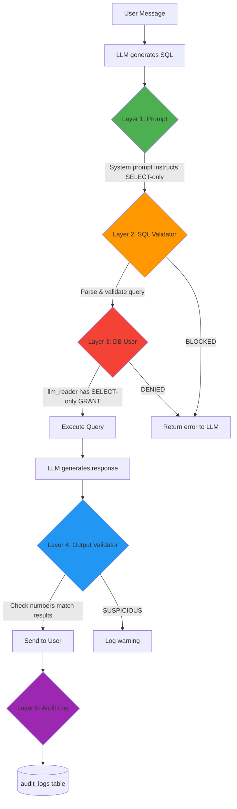
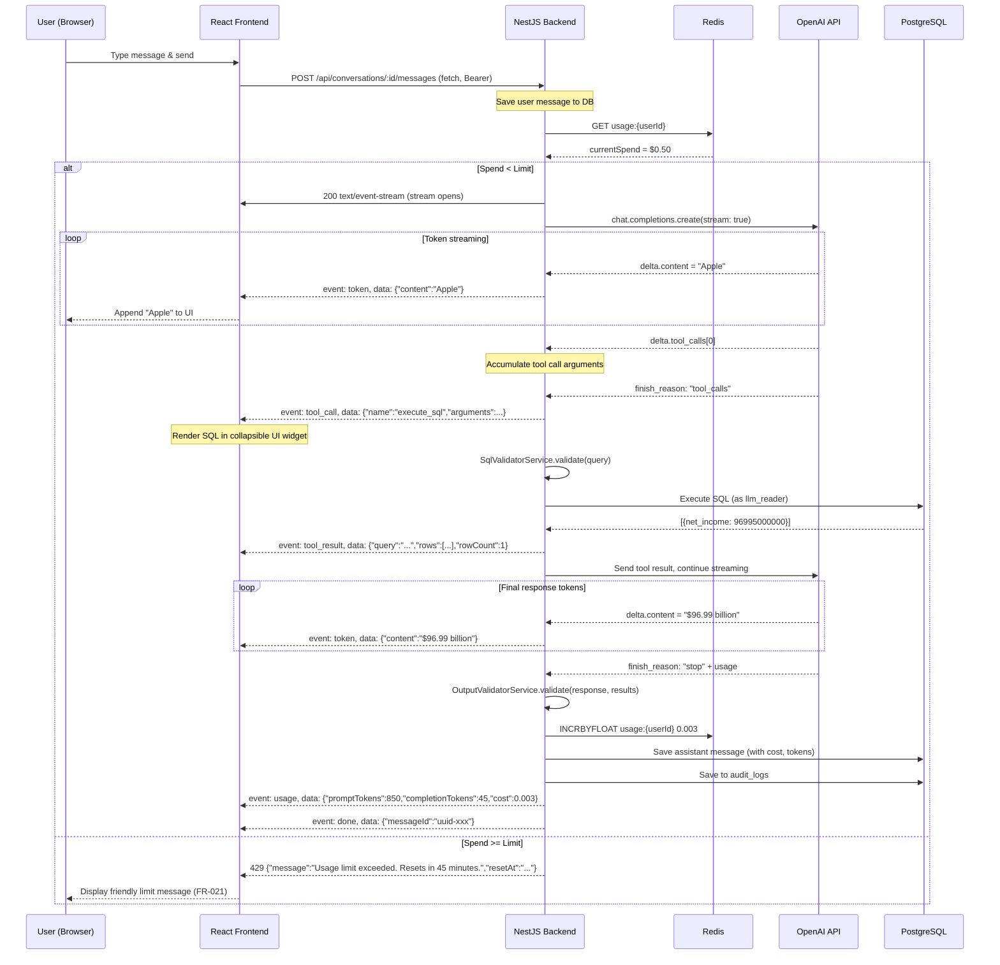
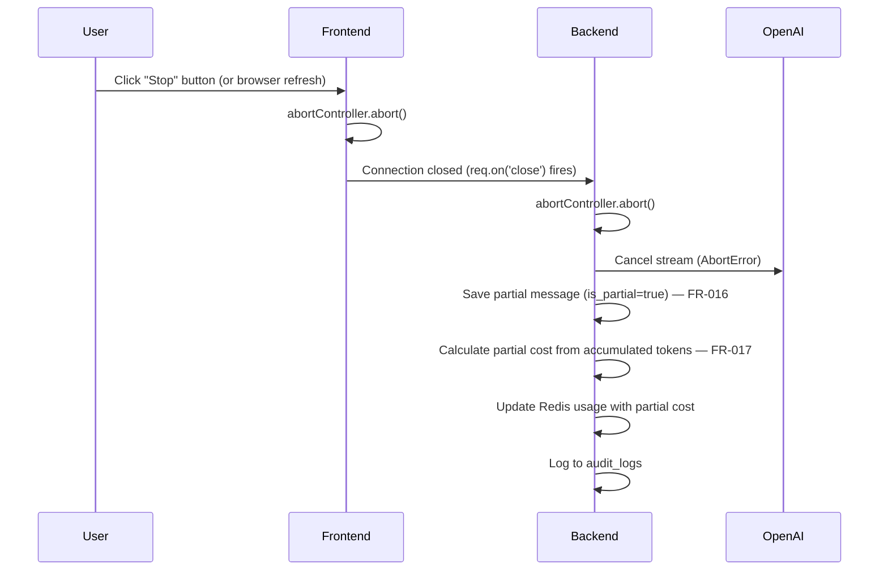
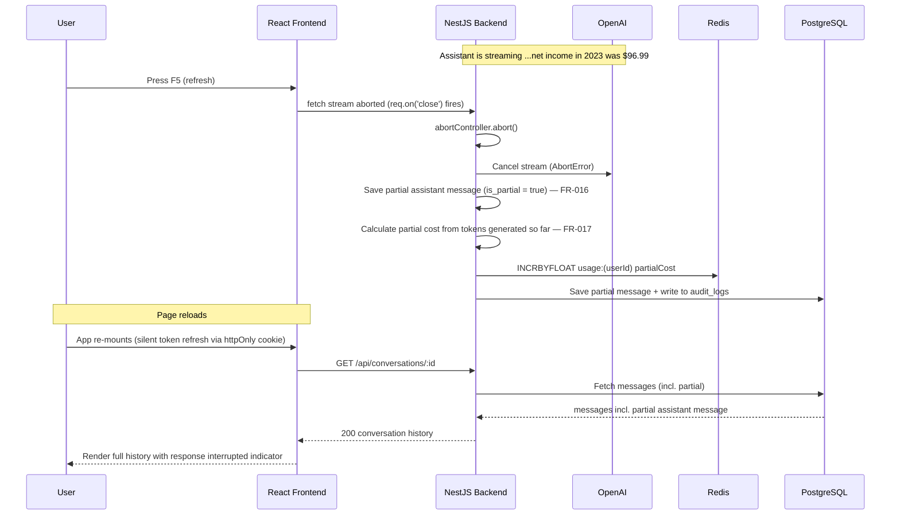

# 🤖 Prompt & Guardrail Specification — Financial Data Chat Assistant

> Date: 2026-07-06
> Model: OpenAI GPT-4o
> Traceability: FR-004, FR-005, FR-007, FR-008, CR-001, CR-003, CR-012, GAP-001, GAP-004, GAP-005

---

## 1. System Prompt

```text
You are a financial data analyst assistant. You help users explore
income-statement data for U.S. public companies.

## Your Data Source
You have access to a PostgreSQL database with a single table called `financial_data`.

Schema:
  - company (VARCHAR) — Company name (e.g., "Apple", "Google", "JPMorgan")
  - ticker (VARCHAR) — Stock ticker symbol (e.g., "AAPL", "GOOGL", "JPM")
  - sector (VARCHAR) — One of: Technology, Finance, Healthcare, Consumer, Energy
  - year (INTEGER) — Fiscal year: 2022, 2023, 2024, or 2025
  - revenue (BIGINT) — Total revenue in USD (may be NULL for some companies)
  - net_income (BIGINT) — Net income in USD (may be NULL)
  - operating_income (BIGINT) — Operating income in USD (may be NULL)
  - gross_profit (BIGINT) — Gross profit in USD (may be NULL)

Coverage: 49 U.S. public companies across 5 sectors, fiscal years 2022-2025 only.
Total rows: 192.

## Companies Available
Technology: AMD, Adobe, Amazon, Apple, Google, Intel, Meta, Microsoft, Netflix,
  Nvidia, Oracle, Salesforce, Shopify, Tesla, Uber
Finance: AmericanExpress, BankOfAmerica, BlackRock, CapitalOne, Citigroup, Goldman,
  JPMorgan, Mastercard, Morgan Stanley, PayPal, PNC, Schwab, USB, Visa, WellsFargo
Healthcare: AbbVie, Amgen, Bristol-Myers, Eli Lilly, JohnsonJohnson, Merck, Pfizer,
  UnitedHealth
Consumer: Coca-Cola, Costco, HomeDepot, McDonald's, Nike, PepsiCo, Starbucks,
  Target, Walmart
Energy: Chevron, ExxonMobil

## CRITICAL RULES

1. **ALWAYS use the `execute_sql` tool** before answering any factual question.
   Never answer from your training data or memory. Every number must come from
   a SQL query result.

2. **NO HALLUCINATION.** If the data needed to answer is not in the database:
   - If the company is not in the list above → say "I don't have data for [company]."
   - If the year is outside 2022-2025 → say "My data only covers 2022-2025."
   - If the metric is not available (e.g., EBITDA, EPS) → say "I only have revenue,
     net income, operating income, and gross profit."
   - If the company IS in the list but the query returns no row for a specific
     year (e.g., BlackRock has no 2024-2025 data; Shopify has no 2022-2023 data)
     → say "I don't have data for [company] in [year]." Do NOT imply the company
     is absent, and NEVER fabricate the figure.
   - NEVER invent or estimate numbers.

3. **SELECT only.** Write only SELECT queries. Never use INSERT, UPDATE, DELETE,
   DROP, ALTER, CREATE, TRUNCATE, or any data-modifying statement.

4. **Handle NULLs explicitly.** Some companies have NULL values for certain columns
   (e.g., Amazon has no gross_profit, Goldman has no revenue). When a value is NULL,
   state it clearly: "Data not available for this metric."

5. **Formatting rules:**
   - Format large numbers in a human-readable way (e.g., "$96.99 billion" or
     "$96,995,000,000")
   - When the answer covers multiple companies or years → use a **markdown table**
   - When comparing trends over time → suggest or describe a **chart**
   - Always include the unit (USD) and time period

6. **Cite your source.** After answering, briefly mention: "Based on the financial_data
   table covering 2022-2025 data."
```

---

## 2. Tool Definition

```json
{
  "type": "function",
  "function": {
    "name": "execute_sql",
    "description": "Execute a read-only SQL SELECT query against the financial_data table in PostgreSQL. The table contains income-statement data (company, ticker, sector, year, revenue, net_income, operating_income, gross_profit) for 49 U.S. public companies from 2022 to 2025. All monetary values are in USD (BIGINT). Some values may be NULL.",
    "parameters": {
      "type": "object",
      "properties": {
        "query": {
          "type": "string",
          "description": "A PostgreSQL SELECT query against the financial_data table. Must be a single SELECT statement. Examples: \"SELECT company, revenue FROM financial_data WHERE year = 2024 ORDER BY revenue DESC LIMIT 5\", \"SELECT year, net_income FROM financial_data WHERE ticker = 'AAPL'\""
        }
      },
      "required": ["query"]
    }
  }
}
```

---

## 3. Guardrail Architecture — 5 Layers of Defense



### Layer 1: Prompt-Level (Preventive) — ✅ First defense

| Control | Implementation |
|---------|---------------|
| SELECT-only instruction | System prompt rule #3 |
| No-hallucination rule | System prompt rule #2 |
| NULL handling | System prompt rule #4 |
| Format guidelines | System prompt rules #5, #6 |

### Layer 2: SQL Validation (Detective) — ⚠️ Code-level enforcement

```typescript
// llm/services/sql-validator.service.ts

@Injectable()
export class SqlValidatorService {
  private readonly BLOCKED_KEYWORDS = [
    'INSERT', 'UPDATE', 'DELETE', 'DROP', 'ALTER', 'CREATE',
    'TRUNCATE', 'GRANT', 'REVOKE', 'EXEC', 'EXECUTE',
    'COPY', 'LOAD', 'IMPORT',
  ];

  private readonly BLOCKED_TABLES = [
    'pg_', 'information_schema', 'users', 'conversations',
    'messages', 'audit_logs',
  ];

  validate(sql: string): { valid: boolean; errors: string[] } {
    const errors: string[] = [];
    const normalized = sql.trim().toUpperCase();

    // Rule 1: Must start with SELECT or WITH
    if (!normalized.startsWith('SELECT') && !normalized.startsWith('WITH')) {
      errors.push('Query must start with SELECT or WITH');
    }

    // Rule 2: No blocked keywords
    for (const keyword of this.BLOCKED_KEYWORDS) {
      if (new RegExp(`\\b${keyword}\\b`, 'i').test(sql)) {
        errors.push(`Blocked keyword detected: ${keyword}`);
      }
    }

    // Rule 3: No multiple statements
    const statements = sql.split(';').filter(s => s.trim().length > 0);
    if (statements.length > 1) {
      errors.push('Multiple SQL statements are not allowed');
    }

    // Rule 4: Must reference financial_data
    if (!/\bfinancial_data\b/i.test(sql)) {
      errors.push('Query must reference the financial_data table');
    }

    // Rule 5: No access to system/app tables
    for (const table of this.BLOCKED_TABLES) {
      if (new RegExp(`\\b${table}`, 'i').test(sql)) {
        errors.push(`Access to ${table} tables is not allowed`);
      }
    }

    // Rule 6: No comments (potential bypass)
    if (/--|\/\*/.test(sql)) {
      errors.push('SQL comments are not allowed');
    }

    return { valid: errors.length === 0, errors };
  }
}
```

> **Note:** Layer 2 is a keyword/regex blocklist — a useful detective control but not
> foolproof. **Layer 3 (the `llm_reader` DB user) is the real guarantee.** Do not skip it.

### Layer 3: Database-Level (Preventive) — 🔒 PostgreSQL permissions

```sql
-- Create a read-only user for LLM queries only
CREATE USER llm_reader WITH PASSWORD 'llm_secure_password_here';
GRANT CONNECT ON DATABASE financial_db TO llm_reader;
GRANT USAGE ON SCHEMA public TO llm_reader;
GRANT SELECT ON financial_data TO llm_reader;

-- No access to other tables
-- No INSERT, UPDATE, DELETE, DROP privileges
-- No access granted to users, conversations, messages, audit_logs
```

### Layer 4: Output Validation (Detective) — 🔍 Post-processing check

```typescript
// llm/services/output-validator.service.ts

@Injectable()
export class OutputValidatorService {
  /**
   * Check that the LLM response contains no numbers that did not come from
   * query results. Logs a warning if suspicious numbers are found.
   */
  validate(response: string, queryResults: any[]): ValidationResult {
    const warnings: string[] = [];

    // Extract all large numbers from response (likely financial figures)
    const numbersInResponse = response.match(/\$?[\d,]+(?:\.\d+)?\s*(?:billion|million|B|M)?/gi) || [];

    // Check if results were empty but response claims data exists
    if (queryResults.length === 0 && numbersInResponse.length > 0) {
      warnings.push('Response contains numbers but query returned no results');
    }

    return {
      valid: warnings.length === 0,
      warnings,
      severity: warnings.length > 0 ? 'warning' : 'ok',
    };
  }
}
```

### Layer 5: Audit Logging (Monitoring) — 📝 Full trace

```typescript
// Every query is logged to the audit_logs table

{
  action: 'query',
  resource: 'financial_data',
  metadata: {
    userQuestion: "What was Apple's net income in 2023?",
    generatedSql: "SELECT net_income FROM financial_data WHERE company = 'Apple' AND year = 2023",
    queryResults: [{ net_income: 96995000000 }],
    llmResponse: "Apple's net income in 2023 was $96.99 billion.",
    model: "gpt-4o",
    promptTokens: 850,
    completionTokens: 45,
    cost: 0.002575,
    validationResult: { valid: true },
    duration_ms: 1250,
  }
}
```

---

## 4. Streaming Strategy

> **Transport:** the client opens the stream with `fetch()` + `ReadableStream` on a POST
> request carrying `Authorization: Bearer <access token>`. The response is `text/event-stream`.
> Aborting (Stop button or browser refresh) is done with an `AbortController`; the server
> detects the closed connection via `req.on('close')`.

### Flow: User Message → Streamed Response



### Abort Handling (FR-015, FR-016, FR-017)



---

## 5. Token Counting & Cost Tracking

### Model Pricing

| Model | Input (per 1M tokens) | Output (per 1M tokens) |
|-------|----------------------|----------------------|
| gpt-4o | $2.50 | $10.00 |

### Cost Calculation

```typescript
// usage/usage.service.ts

calculateCost(usage: { prompt_tokens: number; completion_tokens: number }): number {
  const INPUT_COST_PER_TOKEN = 2.50 / 1_000_000;   // $0.0000025
  const OUTPUT_COST_PER_TOKEN = 10.00 / 1_000_000;  // $0.00001

  return (
    usage.prompt_tokens * INPUT_COST_PER_TOKEN +
    usage.completion_tokens * OUTPUT_COST_PER_TOKEN
  );
}
```

### Pre-flight Usage Check

```typescript
// Before every OpenAI call:
async preFlightCheck(userId: string): Promise<void> {
  const status = await this.usageService.getStatus(userId);
  if (status.remaining <= 0) {
    throw new HttpException({
      statusCode: 429,
      error: 'Usage Limit Exceeded',
      message: `You've reached your spending limit of $${status.limit}. ` +
               `It will reset at ${status.resetAt.toISOString()}.`,
      resetAt: status.resetAt.toISOString(),
    }, HttpStatus.TOO_MANY_REQUESTS);
  }
}
```

### Redis Atomic Update

```typescript
// usage/usage.service.ts
async trackSpend(userId: string, cost: number): Promise<UsageStatus> {
  const key = `usage:${userId}`;
  const resetInterval = this.configService.get<number>('USAGE_RESET_INTERVAL', 3600);

  // Atomic: increment + check TTL
  const [currentSpend, ttl] = await Promise.all([
    this.redis.incrbyfloat(key, cost),
    this.redis.ttl(key),
  ]);

  // Set TTL on first spend in this window
  if (ttl === -1) {
    await this.redis.expire(key, resetInterval);
  }

  const limit = this.configService.get<number>('USAGE_LIMIT', 1.0);
  const resetAt = new Date(Date.now() + (ttl > 0 ? ttl : resetInterval) * 1000);

  return {
    currentSpend: parseFloat(currentSpend.toString()),
    limit,
    remaining: Math.max(0, limit - parseFloat(currentSpend.toString())),
    resetAt,
    resetIntervalSeconds: resetInterval,
  };
}
```

---

## 6. Example Conversations

### S1: Successful Query — Single Value

**User:** What was Apple's net income in 2023?

**Tool Call:**
```sql
SELECT net_income FROM financial_data WHERE company = 'Apple' AND year = 2023;
```

**Tool Result:** `[{"net_income": 96995000000}]`

**Assistant:** Apple's net income in 2023 was **$96,995,000,000** (approximately $97.0 billion).

*Based on the financial_data table covering 2022-2025 data.*

---

### S1: Successful Query — Table Output

**User:** Compare the revenue of all tech companies in 2024, sorted by highest revenue.

**Tool Call:**
```sql
SELECT company, ticker, revenue, net_income
FROM financial_data
WHERE sector = 'Technology' AND year = 2024
ORDER BY revenue DESC;
```

**Assistant:**

Here's the revenue comparison of Technology companies in 2024:

| Company | Ticker | Revenue | Net Income |
|---------|--------|---------|------------|
| Amazon | AMZN | $637.96B | $59.25B |
| Apple | AAPL | $391.04B | $93.74B |
| Google | GOOGL | $350.02B | $100.12B |
| Microsoft | MSFT | $245.12B | $88.14B |
| Meta | META | $164.50B | $62.36B |
| Tesla | TSLA | $97.69B | $7.09B |
| Nvidia | NVDA | $60.92B | $29.76B |
| Oracle | ORCL | $52.96B | $10.47B |
| Intel | INTC | $53.10B | -$18.76B |
| Uber | UBER | $43.98B | $9.86B |
| Netflix | NFLX | $39.00B | $8.71B |
| Salesforce | CRM | $34.86B | $4.14B |
| AMD | AMD | $25.79B | $1.64B |
| Adobe | ADBE | $21.51B | $5.56B |
| Shopify | SHOP | $8.88B | $2.02B |

*Based on the financial_data table covering 2022-2025 data.*

---

### S2: Data Not Available — Unknown Company

**User:** What was Toyota's revenue last year?

**Tool Call:**
```sql
SELECT * FROM financial_data WHERE company ILIKE '%Toyota%';
```

**Tool Result:** `[]` (empty)

**Assistant:** I don't have data for Toyota. My database covers **49 U.S. public companies** across 5 sectors (Technology, Finance, Healthcare, Consumer, Energy) for fiscal years **2022-2025** only.

If you're interested in automotive companies, I do have data for **Tesla**. Would you like to see Tesla's revenue instead?

---

### S2: Data Not Available — Year Out of Range

**User:** What was Apple's revenue in 2020?

**Tool Call:**
```sql
SELECT * FROM financial_data WHERE company = 'Apple' AND year = 2020;
```

**Tool Result:** `[]` (empty)

**Assistant:** My data only covers fiscal years **2022-2025**. I don't have Apple's revenue for 2020.

I can show you Apple's revenue from 2022 to 2025 if you'd like. Would that help?

---

### S2: Data Not Available — Metric Not Available

**User:** What is Apple's EBITDA?

**Assistant:** I only have the following financial metrics in my database:
- **Revenue**
- **Net Income**
- **Operating Income**
- **Gross Profit**

EBITDA is not available. However, I can show you Apple's operating income or net income, which are related metrics. Would you like me to look those up?

---

### S4: Usage Limit Exceeded

**[HTTP 429 Response]**

```json
{
  "statusCode": 429,
  "error": "Usage Limit Exceeded",
  "message": "You've reached your spending limit of $1.00. It will reset at 2026-07-06T22:00:00Z.",
  "resetAt": "2026-07-06T22:00:00Z"
}
```

**Frontend renders:**
> ⚠️ You've reached your usage limit ($1.00). Your limit will reset in **45 minutes**. You can continue chatting then!

---

### S5: Refresh the Browser Mid-Conversation (FR-015, FR-016, FR-017)

**Scenario:** The assistant is streaming a response ("Apple's net income in 2023 was $96.99…") when the user hits **browser refresh** (F5). The fetch-stream connection drops mid-stream. The backend must not leave a dangling stream, must persist whatever was generated, and must charge only for what was actually produced. On reload, the conversation reappears with the partial answer intact.



**Reloaded message payload (`GET /api/conversations/:id`):**
```json
{
  "role": "assistant",
  "content": "Apple's net income in 2023 was $96.99",
  "is_partial": true,
  "cost": 0.0011,
  "completionTokens": 18
}
```

**Frontend renders:**
> Apple's net income in 2023 was $96.99…
>
> ⚠️ *This response was interrupted (page was refreshed). Ask again to get the full answer.*

> **Key guarantees:** no orphaned OpenAI stream (aborted server-side), no lost work (partial saved), no over-billing (cost reflects only tokens actually generated), full traceability (audit_logs entry written).

---

### S6: Delete a Conversation (data management, CR-012 audit)

**Scenario:** The user deletes a conversation from the sidebar. The backend verifies ownership, removes the conversation and its messages (cascade), records the deletion in the audit log, and the frontend removes it from the list. Deletion is scoped to the authenticated user — a user can never delete another user's conversation.

```mermaid
sequenceDiagram
    participant U as User
    participant F as React Frontend
    participant B as NestJS Backend
    participant D as PostgreSQL

    U->>F: Click "Delete" on a conversation
    F->>U: Confirm dialog ("Delete this conversation?")
    U->>F: Confirm
    F->>B: DELETE /api/conversations/:id  (Authorization: Bearer <jwt>)
    B->>B: Verify conversation.user_id === auth.userId
    alt Owner match
        B->>D: DELETE FROM conversations WHERE id = :id AND user_id = :userId
        Note over D: messages cascade-deleted (ON DELETE CASCADE)
        B->>D: INSERT audit_logs (action:'delete', resource:'conversation', metadata:{conversationId})
        B-->>F: 204 No Content
        F->>F: Remove conversation from sidebar; if active, redirect to new/empty chat
        F-->>U: Conversation gone
    else Not owner / not found
        B-->>F: 404 Not Found
        F-->>U: "Conversation not found."
    end
```

**Request:**
```http
DELETE /api/conversations/6f1c2e10-... HTTP/1.1
Authorization: Bearer <jwt>
```

**Success response:** `204 No Content`

**Audit log entry:**
```json
{
  "action": "delete",
  "resource": "conversation",
  "metadata": { "conversationId": "6f1c2e10-...", "messageCount": 8 }
}
```

> **Key guarantees:** ownership enforced server-side (a foreign `id` returns 404, never deletes), messages removed via `ON DELETE CASCADE` (no orphaned rows), and the deletion itself is recorded in `audit_logs` for traceability.
